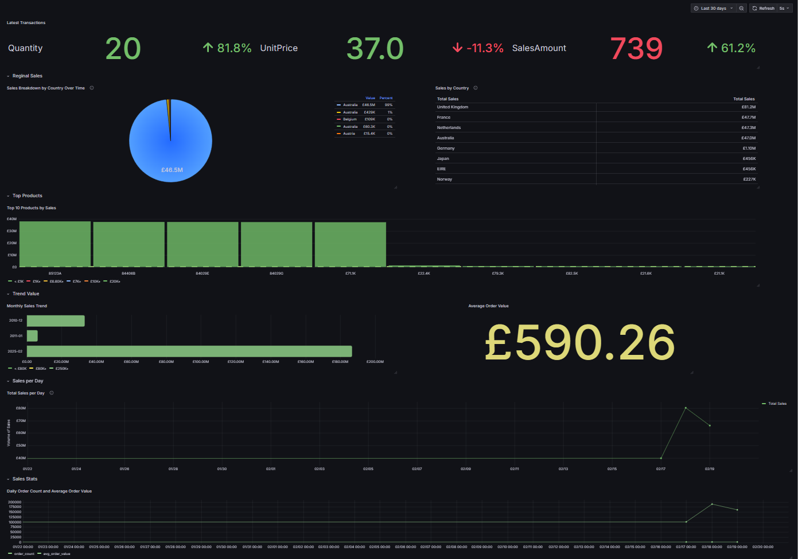

https://github.com/DavidG002/ClickPulse:

markdown
Wrap
Copy
# ClickPulse: ClickHouse Analytics Demo

 <!-- Placeholder for your screenshot -->

ClickPulse is a lightweight demo showcasing the power of [ClickHouse](https://clickhouse.com/)—an open-source, column-oriented database—for real-time analytics. Built with Django, ClickHouse, and Grafana, it ingests a large e-commerce CSV dataset and visualizes it with a dynamic dashboard, featuring a real-time simulator that updates live. This project highlights ClickHouse’s simplicity, speed, and scalability for modern data analytics, perfect for a sales pitch demonstrating open-source integration.

## How It Works
- **Data Ingestion**: Loads a 500k+ row CSV from the UCI “Online Retail” dataset (UK retailer transactions, 2010-2011) into ClickHouse using `ingest_data.py`.
- **Real-Time Simulation**: `simulate_realtime.py` inserts random sales records every 2 seconds when activated, mimicking live data streams.
- **Visualization**: Grafana dashboards display metrics (e.g., sales per day, latest transactions) with a 5-second refresh, served via Django at `http://localhost:8000/api/analytics/grafana/` locally or `https://clickpulse.daveedg.com/api/analytics/grafana/` on the VPS.
- **Tech Stack**:
  - **ClickHouse**: Fast, scalable database (port `9000`).
  - **Grafana**: Visualization (port `3100` on VPS, `3000` locally).
  - **Django**: Web framework (port `8000`).
  - **Docker**: Containerized deployment.

## Prerequisites
- Docker and Docker Compose installed.
- GitHub repository cloned: `git clone https://github.com/DavidG002/ClickPulse.git`.
- CSV file (`CSV-files/data.csv`) from [UCI Online Retail](https://archive.ics.uci.edu/ml/datasets/online+retail) in the repo root.

## Setup Instructions
1. **Clone the Repository**:
   ```bash
   git clone https://github.com/DavidG002/ClickPulse.git
   cd ClickPulse
2. **Run the App**:
   ```bash
   docker compose up --build -d
     - Builds and starts all services (web, grafana, clickhouse, etc.).
     - Wait ~1 minute for ClickHouse and Grafana to initialize.
3. **Access the Dashboard**:
     - Local: http://localhost:8000/api/analytics/grafana/.
     - VPS (if deployed): https://clickpulse.daveedg.com/api/analytics/grafana/.
4. **Stopping the App**:
d   ```bash
    docker compose down
     
- Stops all containers. Add -v to remove volumes (e.g., docker compose down -v).

## Running and Stopping the Real-Time Simulator
1. **Start the Simulator**:
    ```bash
    docker exec clickpulse-realtime_simulator-1 touch /code/simulator_flag.txt
        
        - Inserts 5 random records every 2 seconds into ClickHouse.
        - Dashboard updates live (e.g., “Latest Transactions” panel).

2. **Stop the Simulator**:
    ```bash
    docker exec clickpulse-realtime_simulator-1 rm /code/simulator_flag.txt
        
        -Pauses insertion—dashboard reflects static data until restarted.

## Project Structure
 - scripts/ingest_data.py: Loads CSV into ClickHouse.
 - scripts/simulate_realtime.py: Real-time data simulator.
 - analytics/views.py: Django view for Grafana dashboard.
 - provisioning/: Grafana dashboard JSON and datasource config.
 - docker-compose.yml: Multi-service orchestration.

## ClickHouse Benefits Showcased
 - Simplicity: Easy CSV ingestion and dashboard setup.
 - Powerful: Handles 500k+ records with complex queries.
 - Fast: Sub-second query execution.
 - Real-Time: Live updates via simulator.
 - Open-Source: Free, flexible tools.
 - Scalable: Ready for larger datasets.
## Deployment
 - Deployed via GitHub Actions to a VPS—see .github/workflows/deploy.yml.
 - Live at: https://clickpulse.daveedg.com/api/analytics/grafana/.

## Screenshot




### Acknowledgments
 - Dataset: UCI “Online Retail” by Dr. Daqing Chen.
 - Tools: ClickHouse, Grafana, Django, Docker.